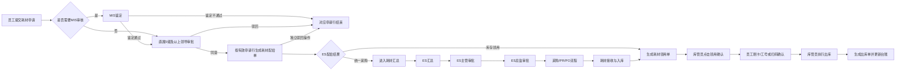

# 耗材申请、配给、领用与汇总 PRD

> 文档状态：原型版 1.1  
> 更新日期：2026-08-05  
> 适用范围：耗材申请后续审批、配给、领用确认及统一采购汇总流程  
> 页面规范：`docs/UI_DESIGN_GUIDELINES.md`

## 1. 项目背景

耗材申请流程包含员工申请、MIS 鉴定、直属 5 级及以上领导审批、ES 配给、库存领用或统一采购、耗材领用、员工确认、出库以及统一采购汇总等环节。

本次将初稿 PRD、流程图和后续页面评审结论统一整理，作为当前个人工作台网页原型、后续设计、开发和 UAT 的共同依据。

## 2. 建设目标

1. 建立耗材审批、配给、领用确认和统一采购汇总的线上闭环。
2. 支持低值耐用品与普通耗材的差异化处理。
3. 根据物料属性判断是否需要 MIS 鉴定、是否需要关联主资产。
4. 支持库存领用和统一采购两种配给结果。
5. 员工完成领用确认后，由库管员执行出库并更新台账。
6. 按公司维度汇总统一采购需求，并衔接采购、PR、PO 流程。
7. 所有个人工作台页面遵循统一的 Card、三列详情、状态和按钮规范。

## 3. 当前原型范围

### 3.1 个人工作台保留页面

| 序号 | 页面 | 菜单名称 |
|---|---|---|
| 1 | 耗材 MIS 鉴定 | 耗材MIS鉴定 |
| 2 | 直属 5 级及以上领导审批 | 耗材审批 |
| 3 | 耗材配给 | 耗材配给 |
| 4 | 耗材领用 | 耗材领用 |
| 5 | 员工耗材领用确认 | 员工耗材领用确认 |
| 6 | 耗材汇总明细及详情 | 耗材汇总 |
| 7 | 耗材汇总审批 | 耗材汇总审批 |

### 3.2 不在当前原型范围

- 独立“耗材申请”页面已从个人工作台删除。
- 员工提交耗材申请仍属于完整业务流程的上游环节，但本轮不单独展示该页面原型。
- 采购、PR、PO、接收和入库页面暂以流程状态和演示数据承接，不在个人工作台新增独立页面。

## 4. 角色与权限

| 角色 | 权限 |
|---|---|
| 申请人 | 提交耗材申请、完成耗材领用确认 |
| MIS 鉴定人 | 查看需 MIS 审核的申请行，维护 MIS 意见和意见说明 |
| 直属 5 级及以上领导 | 查看整单申请耗材信息并审批 |
| ES 耗材管理员 | 处理耗材配给、查看申请人名下资产、匹配库存、转统一采购、驳回或加签 |
| 库管员 | 维护耗材领用信息、发起员工领用确认、执行出库、弃领、加签和发送通知 |
| 申请人（领用确认） | 通过刷卡/员工工号或狐小 e 扫码确认领用 |
| ES 汇总人 | 查看统一采购明细、维护 ES 建议、汇总说明、项目用途和附件并提交审批 |
| ES 主管/ES 总监 | 审批耗材汇总申请 |

## 5. 核心业务对象

### 5.1 耗材申请单

- 一张申请单可以包含多行耗材。
- 单据状态：处理中、已完成、已驳回。
- 申请行可根据物料配置进入 MIS 鉴定或直接进入领导审批。

### 5.2 耗材配给单

- 一条有效申请行对应一张耗材配给单。
- 单据状态：待配给、已完成、已驳回。
- 匹配状态仅包括：库存领用、统一采购。
- “驳回”是独立流程操作，不属于匹配状态枚举。

### 5.3 耗材领用单

- 库存领用配给完成后生成。
- 统一采购耗材完成接收、入库后生成。
- 流程阶段：库管员领用办理 → 员工领用确认 → 库管员执行出库。

### 5.4 耗材汇总申请单

- 汇总对象：匹配状态为“统一采购”的有效耗材配给单。
- 汇总页面按申请人和申请单分组展示明细。
- 汇总审批节点：ES 主管 → ES 总监。

## 6. 总体流程

## 7. 通用业务规则

1. 耗材物料包括低值耐用品和普通耗材。
2. 耗材申请不设置个人或部门超标限制。
3. 需要关联主资产的耗材，应从申请人名下符合条件的在用资产中选择主资产。
4. 任一申请行需要 MIS 审核时，该申请行进入 MIS 鉴定。
5. 领导审批为整单审批；同意后仅为有效申请行生成配给单。
6. ES 配给的匹配状态仅允许选择“库存领用”或“统一采购”。
7. 配给驳回通过独立“驳回”按钮执行，不增加“驳回类型”字段；驳回时 ES 建议必填。
8. 低值耐用品可维护耗材标签号和序列号；普通耗材无需耗材标签号。
9. 内存或硬盘且已关联主资产时，可展示“是否延长报废期”和“ES 实物报废期”。
10. 耗材领用页不展示“领用确认方式”和“确认状态”字段，确认状态仅用于流程控制。
11. 员工耗材领用确认不支持电子签，只支持刷卡/工号和扫码确认。
12. 员工确认完成后，库管员返回耗材领用页执行最终出库。
13. 审批类页面驳回时审批意见必填；同意时可不填写。
14. 部门路径统一使用“.”连接。

# 8. 页面需求

## 8.1 耗材 MIS 鉴定

### 8.1.1 页面目标

MIS 鉴定人处理需要 MIS 审核的耗材申请行。

### 8.1.2 页面结构

1. 页面标题及申请单号。
2. 申请人信息 Card。
3. 申请耗材信息 Card。
4. 审批信息 Card。
5. 底部操作区。

> 当前页面结构保持不变，本轮不新增独立“MIS 鉴定处理”Card。MIS 意见和意见说明继续在申请耗材信息中维护。

### 8.1.3 申请人信息

| 字段名称 | 组件类型 | 必填 | 可编辑 | 规则说明 |
|---|---|---:|---:|---|
| 申请人 | 文本 | 是 | 否 | 工号-姓名 |
| 申请日期 | 日期 | 是 | 否 | YYYY-MM-DD |
| 公司 | 文本 | 是 | 否 | 自动带出 |
| 办公区 | 文本 | 是 | 否 | 自动带出 |
| 联系电话 | 文本 | 是 | 否 | 自动带出 |
| 邮箱 | 文本 | 是 | 否 | 自动带出 |
| 部门 | 文本 | 是 | 否 | 全路径，使用“.”连接 |

### 8.1.4 申请耗材信息

| 字段名称 | 组件类型 | 必填 | 可编辑 | 规则说明 |
|---|---|---:|---:|---|
| 耗材说明 | 文本 | 是 | 否 | 仅展示需 MIS 审核的申请行 |
| 配置 | 文本 | 否 | 否 | 物料自动带出 |
| 数量 | 数字 | 是 | 否 | 申请数量 |
| 申请原因 | 文本 | 是 | 否 | 申请行值 |
| 详细说明 | 文本 | 是 | 否 | 申请行值 |
| 主资产标签号 | 文本 | 条件展示 | 否 | 关联主资产时展示 |
| 主资产说明 | 文本 | 条件展示 | 否 | 关联主资产时展示 |
| MIS 意见 | 下拉框 | 是 | 是 | 鉴定通过、鉴定不通过 |
| 意见说明 | 多行文本 | 是 | 是 | 最多 400 字 |

### 8.1.5 校验及操作

- 同意时，所有当前可见行的 MIS 意见必须为“鉴定通过”。
- 驳回时，所有当前可见行的 MIS 意见必须为“鉴定不通过”。
- MIS 意见和意见说明均为必填。
- 操作按钮：同意、驳回、返回。

## 8.2 耗材审批

### 8.2.1 页面目标

直属 5 级及以上领导查看整单申请耗材信息并完成审批。

### 8.2.2 页面结构

1. 页面标题及申请单号。
2. 申请人信息 Card。
3. 申请耗材信息 Card。
4. 审批信息及审批操作 Card。

### 8.2.3 申请耗材信息字段

| 字段名称 | 组件类型 | 必填 | 可编辑 | 规则说明 |
|---|---|---:|---:|---|
| 耗材说明 | 文本 | 是 | 否 | 申请耗材说明 |
| 配置 | 文本 | 否 | 否 | 物料配置 |
| 数量 | 数字 | 是 | 否 | 申请数量 |
| 申请原因 | 文本 | 是 | 否 | 申请行值 |
| 详细说明 | 文本 | 是 | 否 | 申请行值 |

页面不展示主资产标签号、主资产说明、MIS 鉴定结果、MIS 鉴定说明和行状态。

### 8.2.4 操作规则

- 同意：为有效申请行生成耗材配给单。
- 驳回：审批意见必填，申请结束。
- 加签：选择人员后发送加签待办。
- 操作按钮：同意、驳回、返回、加签。

## 8.3 耗材配给

### 8.3.1 页面目标

ES 耗材管理员确定耗材采用库存领用或统一采购，并维护 ES 建议。

### 8.3.2 页面结构

1. 页面标题及配给单号。
2. 申请人信息 Card。
3. 申请耗材明细 Card。
4. ES 配给处理 Card。
5. 审批信息 Card。
6. 底部操作区。

### 8.3.3 ES 配给处理字段

| 字段名称 | 组件类型 | 必填 | 可编辑 | 规则说明 |
|---|---|---:|---:|---|
| 匹配状态 | 单选 | 提交必填 | 是 | 仅库存领用、统一采购 |
| 已匹配耗材 | 文本/弹窗选择 | 条件必填 | 是 | 选择库存领用时展示并必填 |
| ES 建议 | 多行文本 | 驳回必填 | 是 | 最多 400 字 |

页面不展示“驳回类型”。

### 8.3.4 操作规则

- 提交 + 库存领用：必须先匹配库存耗材，生成耗材领用单。
- 提交 + 统一采购：进入耗材汇总。
- 驳回：不要求选择匹配状态，ES 建议必填。
- 加签：发送给具备耗材配给权限的人员。
- 操作按钮：提交、驳回、返回、加签。

## 8.4 耗材汇总明细

### 8.4.1 页面目标

ES 汇总人按申请人和申请单核对统一采购需求并维护 ES 建议。

### 8.4.2 页面布局

- 与“统一申请汇总-资产”的汇总明细页保持一致。
- 每个申请人/申请单使用独立 Card。
- Card 顶部展示申请人、申请单号、申请部门。
- Card 右上角展示“驳回”按钮。
- 明细表不展示“是否通过”字段。

### 8.4.3 明细字段

| 字段名称 | 组件类型 | 必填 | 可编辑 | 规则说明 |
|---|---|---:|---:|---|
| 物资类别 | 文本 | 是 | 否 | 耗材分类 |
| 物料说明 | 文本 | 是 | 否 | 耗材说明 |
| 采购数量 | 数字 | 是 | 否 | 汇总数量 |
| 预计费用（元） | 金额 | 是 | 否 | 参考金额 |
| 详细说明 | 文本 | 否 | 否 | 申请详细说明 |
| ES 建议 | 单行文本 | 否 | 是 | 汇总人维护 |

### 8.4.4 操作规则

- 点击 Card 右上角“驳回”，将当前申请人的该申请单全部汇总行标记为驳回。
- 页面不提供逐行“是否通过”选择。
- 页面底部按钮：下一步、保存、返回。

## 8.5 耗材汇总详情

### 8.5.1 页面模块

1. ES 汇总说明。
2. 项目用途说明。
3. 部门汇总信息。
4. 申请明细。
5. 附件信息。

### 8.5.2 ES 汇总说明

- 多行文本，可编辑，最多 1000 字。
- 用于说明汇总周期、汇总范围、采购数量、预计采购费用及 ES 核对情况。

### 8.5.3 项目用途说明

- 多行文本，可编辑，最多 400 字。
- 页面提示：此信息会同步至 PR 系统。

### 8.5.4 部门汇总信息

| 字段 | 说明 |
|---|---|
| 序号 | 自动生成 |
| 部门 | 汇总部门 |
| 申请采购数量 | 当前部门有效采购数量 |
| 预计采购费用（元） | 当前部门预计费用 |

底部展示合计，并提示最终采购价格以 PR 单为准。

### 8.5.5 申请明细

| 字段 | 说明 |
|---|---|
| 序号 | 自动生成 |
| 部门 | 申请部门 |
| 申请单号 | 原耗材申请单号 |
| 申请人 | 工号-姓名 |
| 物资类别 | 耗材分类 |
| 物料说明 | 耗材说明 |
| 采购数量 | 有效采购数量 |
| 预计费用（元） | 参考金额 |
| 申请原因 | 申请原因或详细说明 |
| ES 建议 | 汇总明细维护值 |

底部展示采购数量和预计费用合计。

### 8.5.6 附件信息

- 支持上传附件。
- 支持删除当前页面选择的附件。

### 8.5.7 操作按钮

- 提交：提交至 ES 主管审批。
- 修改：返回耗材汇总明细。

## 8.6 耗材汇总审批

### 8.6.1 页面模块

1. ES 汇总说明。
2. 部门汇总信息。
3. 申请明细。
4. 审批信息。

页面不展示项目用途说明和附件信息。

### 8.6.2 审批信息

- 展示审批历史。
- 审批意见同意时可为空，驳回时必填。
- 操作按钮：同意、驳回、返回。
- ES 主管同意后进入 ES 总监；ES 总监同意后进入采购流程。

## 8.7 耗材领用

### 8.7.1 页面目标

库管员维护实际领用信息，发起员工领用确认，并在员工确认后执行出库。

### 8.7.2 页面结构

1. 页面标题及领用单号。
2. 申请人信息 Card。
3. 申请耗材信息 Card。
4. 审批操作 Card。

页面布局及字段顺序与“ES 前台领用”保持一致。

### 8.7.3 申请人信息

| 字段名称 | 可编辑 | 规则说明 |
|---|---:|---|
| 当前仓库 | 是 | 必填 |
| 申请人 | 否 | 工号-姓名 |
| 联系电话 | 否 | 自动带出 |
| 邮箱 | 否 | 自动带出 |
| 公司 | 否 | 自动带出 |
| 办公区 | 否 | 自动带出 |
| 申请日期 | 否 | YYYY-MM-DD |
| 部门 | 否 | 使用“.”连接 |
| 单据备注 | 是 | 最多 400 字 |

### 8.7.4 申请耗材信息

| 字段名称 | 可编辑 | 规则说明 |
|---|---:|---|
| 耗材标签号 | 条件可编辑 | 低值耐用品可选择，普通耗材为空 |
| 序列号 | 否 | 选择耗材后带出 |
| 所在仓库 | 否 | 选择耗材后带出 |
| 实际耗材说明 | 否 | 实际领用耗材 |
| 配置 | 否 | 实际配置 |
| 数量 | 否 | 领用数量 |
| 公司 | 否 | 自动带出 |
| 板块 | 否 | 自动带出 |
| 启用日期 | 否 | 默认申请日期 |
| 城市 | 是 | 下拉选择 |
| 建筑 | 是 | 下拉选择 |
| 楼层 | 是 | 下拉选择 |
| 主资产标签号 | 否 | 申请行关联值 |
| 主资产说明 | 否 | 申请行关联值 |
| 是否延长报废期 | 条件可编辑 | 内存/硬盘且关联主资产时展示 |
| ES 实物报废期 | 条件展示 | 符合延长规则时展示 |
| 使用说明 | 是 | 最多 400 字 |
| 申请耗材说明 | 否 | 申请参考信息 |
| 申请原因 | 否 | 申请参考信息 |
| 详细说明 | 否 | 申请参考信息 |

页面不展示“领用确认方式”和“确认状态”。

### 8.7.5 审批操作

- 领用确认：保存当前办理字段，发起员工确认并直接进入“员工耗材领用确认”页面。
- 已处于待确认阶段时，再次点击“领用确认”仍进入员工确认页面。
- 员工确认完成后，按钮切换为“执行出库”。
- 执行出库：生成出库单并更新耗材台账。
- 弃领：处理意见必填。
- 加签：选择当前仓库具备出库权限的人员。
- 返回：返回工作台首页。
- 发送领用通知：通知申请人和库管员。

## 8.8 员工耗材领用确认

### 8.8.1 页面目标

员工核对耗材信息和保管职责后，通过刷卡/员工工号或扫码确认领取。

### 8.8.2 页面结构

1. 页面标题及领用单号。
2. 领用确认信息 Card。
3. 确认提示及保管职责 Card。
4. 刷卡/扫码确认 Card。
5. 返回操作区。

### 8.8.3 领用确认信息

| 字段 | 说明 |
|---|---|
| 领用人 | 工号-姓名 |
| 部门 | 使用“.”连接 |
| 耗材说明 | 领用耗材说明 |
| 数量 | 领用数量 |
| 耗材标签号 | 普通耗材展示“-” |
| 主资产标签号 | 未关联时展示“-” |
| 主资产说明 | 未关联时展示“-” |

### 8.8.4 确认方式

仅支持以下两类入口：

1. 刷卡/员工工号确认：输入员工工号后点击确认或按回车。
2. 狐小 e 扫码确认：扫描页面二维码完成确认。

页面不提供电子签确认方式，不展示电子签标签页或签名区域。

### 8.8.5 校验与结果

- 确认前必须勾选“我已阅读并确认耗材保管职责”。
- 输入工号必须与申请人工号一致。
- 确认成功后展示识别员工工号、确认时间、确认方式和确认结果。
- 确认成功后返回耗材领用页，由库管员执行出库。

## 9. 状态流转

### 9.1 耗材配给

| 当前状态 | 操作 | 下一状态/节点 |
|---|---|---|
| 待配给 | 提交-库存领用 | 已完成，生成耗材领用单 |
| 待配给 | 提交-统一采购 | 已完成，进入耗材汇总 |
| 待配给 | 驳回 | 已驳回，流程结束 |

### 9.2 耗材领用

| 当前节点 | 确认状态 | 操作 | 下一节点/结果 |
|---|---|---|---|
| 库管员领用 | 未发起 | 领用确认 | 员工领用确认 |
| 员工领用确认 | 待确认 | 刷卡/工号或扫码确认 | 已确认，返回库管员办理 |
| 库管员领用 | 已确认 | 执行出库 | 已完成，生成出库单并更新台账 |

### 9.3 耗材汇总

| 当前节点 | 操作 | 下一节点 |
|---|---|---|
| ES 汇总 | 提交 | ES 主管 |
| ES 主管 | 同意 | ES 总监 |
| ES 主管 | 驳回 | ES 汇总草稿 |
| ES 总监 | 同意 | 采购/PR/PO 流程 |
| ES 总监 | 驳回 | ES 汇总草稿 |

## 10. UAT 验收清单

- [ ] 个人工作台不存在独立“耗材申请”菜单。
- [ ] 耗材 MIS 意见仅包含“鉴定通过、鉴定不通过”。
- [ ] 耗材 MIS 鉴定当前不拆分独立处理 Card。
- [ ] 耗材审批明细只展示耗材说明、配置、数量、申请原因和详细说明。
- [ ] 耗材配给匹配状态只有库存领用和统一采购。
- [ ] 耗材配给不存在驳回类型字段。
- [ ] 耗材汇总明细不存在“是否通过”字段。
- [ ] 每个汇总申请人 Card 右上角存在“驳回”按钮。
- [ ] 耗材领用不展示领用确认方式和确认状态。
- [ ] 点击“领用确认”后直接进入员工耗材领用确认页面。
- [ ] 员工确认完成后，耗材领用按钮切换为“执行出库”。
- [ ] 员工耗材领用确认不展示电子签方式。
- [ ] 员工耗材领用确认支持刷卡/工号和扫码确认。
- [ ] 所有页面符合 `docs/UI_DESIGN_GUIDELINES.md`。
