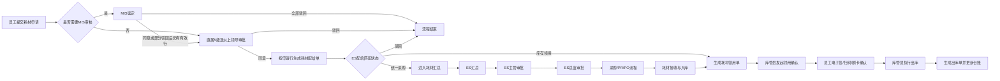

# 耗材申请、配给、领用与汇总 PRD

> 文档状态：原型版 1.0  
> 适用范围：个人工作台下的耗材申请全流程  
> 设计规范：`docs/UI_DESIGN_GUIDELINES.md`

## 1. 项目背景

现有耗材申请流程包含申请、MIS 鉴定、直属 5 级及以上领导审批、ES 配给、库存领用或统一采购、耗材领用、员工确认、出库以及耗材汇总采购等多个环节。原有初稿中业务规则、页面字段和流程说明分散，本次将其统一整理为按页面组织、可直接用于设计、开发和 UAT 的 PRD，并同步在个人工作台中提供可运行原型。

## 2. 建设目标

1. 建立耗材申请、审批、配给、领用、员工确认、汇总采购的完整线上闭环。
2. 支持低值耐用品与普通耗材两类物料申请。
3. 根据物料属性自动判断是否需要 MIS 鉴定、是否必须关联主资产。
4. 支持库存领用和统一采购两种配给路径。
5. 支持低值耐用品与普通耗材的差异化领用与出库规则。
6. 按公司维度每周汇总统一采购需求，并衔接采购、PR、PO 信息。
7. 统一个人工作台页面设计语言和交互规范。

## 3. 角色与权限

| 角色 | 权限 |
|---|---|
| 申请人 | 查看可申请耗材、筛选耗材、提交申请、查看申请记录及流程 |
| MIS 鉴定人 | 仅查看需要 MIS 审核的申请行，填写 MIS 意见和意见说明 |
| 直属 5 级及以上领导 | 查看整单全部申请行，整单同意或驳回 |
| ES 耗材管理员 | 处理耗材配给、查看申请人名下资产、加签、驳回、匹配库存或转统一采购 |
| 库管员 | 处理耗材领用、发送领用通知、发起员工确认、执行出库、弃领、转签 |
| 申请人（领用确认） | 通过狐小 e 电子签、扫码或刷卡/工号确认领用 |
| ES 汇总人 | 按公司查看统一采购明细、维护 ES 建议、汇总说明和项目用途、提交审批 |
| ES 主管/ES 总监 | 审批耗材汇总申请 |

## 4. 核心业务对象

### 4.1 耗材申请单

- 一张申请单可以包含多行耗材。
- 单据状态：处理中、已完成、已驳回。
- 行状态：空、处理中、已驳回、已配给、已领用、已入库、已处理。

### 4.2 耗材配给单

- 拆分规则：申请单一行对应一张配给单。
- 单据状态：待配给、已完成、已驳回。
- 匹配状态：库存领用、统一采购、驳回。

### 4.3 耗材领用单

- 由库存领用的配给单直接生成。
- 统一采购的配给单在耗材入库后生成。
- 单据状态：处理中、已完成、已驳回。

### 4.4 耗材汇总申请单

- 汇总对象：匹配状态为“统一采购”的耗材配给单。
- 汇总维度：集团&媒体、视频、焦点、上海分公司、广州分公司。
- 单据状态：草稿、处理中、已汇总、已驳回。

## 5. 总体流程

## 6. 通用业务规则

1. 申请耗材范围为物料类型“低值耐用品”和“耗材”。
2. 耗材申请不设置超标限制。
3. 同类型耗材重复添加时，系统提示并合并增加申请数量，不重复生成相同行。
4. 当物料“是否关联主资产”为是时：
   - 当前行显示“主资产标签号”和“主资产说明”。
   - 主资产标签号必填。
   - 可选数据仅包含申请人名下“在用-使用中”资产。
   - 按物料配置的“主资产物料小类”进一步过滤。
5. 当任一申请行“是否 MIS 审核”为是时，申请单进入 MIS 鉴定；MIS 页面仅展示需审核的申请行。
6. MIS 驳回后将当前可见行状态更新为“已驳回”；若全部申请行均已驳回，整单结束，否则进入 5 级审批。
7. 直属 5 级及以上领导审批为整单审批；同意后仅针对未驳回行生成配给单。
8. 配给单提交规则：
   - 提交时匹配状态只能为“库存领用”或“统一采购”。
   - 驳回时匹配状态必须为“驳回”。
9. 低值耐用品具有耗材标签号、序列号和台账卡片；普通耗材的耗材标签号为空。
10. 内存或硬盘且已关联主资产时，领用页面显示“是否延长报废期”和“ES 实物报废期”。
11. 员工确认完成后，由库管员执行出库，生成出库单并更新台账。
12. 所有审批页面：同意时审批意见可选；驳回时审批意见必填。

## 7. 页面清单

| 序号 | 页面 | 个人工作台菜单 |
|---|---|---|
| 1 | 耗材申请 | 耗材申请 |
| 2 | 耗材 MIS 鉴定 | 耗材MIS鉴定 |
| 3 | 直属 5 级及以上领导审批 | 耗材审批 |
| 4 | 耗材配给 | 耗材配给 |
| 5 | 耗材领用 | 耗材领用 |
| 6 | 员工耗材领用确认 | 员工耗材领用确认 |
| 7 | 耗材汇总 | 耗材汇总 |
| 8 | 耗材汇总审批 | 耗材汇总审批 |

# 8. 页面需求

## 8.1 耗材申请

### 8.1.1 页面目标

申请人选择低值耐用品或耗材，填写数量、申请原因、详细说明及主资产信息并提交。

### 8.1.2 页面结构

1. 申请须知弹窗。
2. 申领耗材信息 Card。
3. 预览页面。
4. 页面底部操作区。

### 8.1.3 字段定义

| 字段名称 | 组件类型 | 必填 | 可编辑 | 规则说明 |
|---|---|---:|---:|---|
| 耗材说明 | 单行文本 | 是 | 否 | 耗材小类.品牌.型号 |
| 数量 | 数字输入 | 是 | 是 | 大于等于 1 的整数 |
| 申请原因 | 下拉框 | 是 | 是 | 日常办公使用、特殊项目采购、提升电脑配置使用、部门公共设备使用 |
| 主资产标签号 | 下拉选择 | 条件必填 | 是 | 仅“是否关联主资产”为是时展示 |
| 主资产说明 | 单行文本 | 否 | 否 | 选择主资产标签号后自动带出 |
| 详细说明 | 多行文本 | 是 | 是 | 最多 400 字 |

### 8.1.4 交互规则

1. 首次进入弹出申请须知，只允许点击“已阅读”关闭。
2. 点击“添加耗材”打开耗材选择弹窗。
3. 弹窗只展示低值耐用品与耗材。
4. 重复选择同一耗材时不新增行，自动增加数量并提示。
5. 点击“预览”时校验所有必填字段。
6. 预览页只读，底部按钮为“上一步”“提交”。
7. 提交后根据是否存在 MIS 审核行进入 MIS 鉴定或 5 级审批。

## 8.2 耗材 MIS 鉴定

### 8.2.1 页面目标

MIS 鉴定人仅处理需要 MIS 审核的申请行。

### 8.2.2 页面结构

1. 页面标题和申请单号。
2. 申请人信息。
3. 申请耗材信息。
4. 审批信息。
5. 操作区。

### 8.2.3 字段定义

| 字段名称 | 组件类型 | 必填 | 可编辑 | 规则说明 |
|---|---|---:|---:|---|
| 申请人 | 文本 | 是 | 否 | 工号-姓名 |
| 申请日期 | 日期 | 是 | 否 | YYYY-MM-DD |
| 公司 | 文本 | 是 | 否 | 自动带出 |
| 办公区 | 文本 | 是 | 否 | 自动带出 |
| 联系电话 | 文本 | 是 | 否 | 自动带出 |
| 邮箱 | 文本 | 是 | 否 | 自动带出 |
| 部门 | 文本 | 是 | 否 | 全路径，使用“.”连接 |
| 耗材说明 | 文本 | 是 | 否 | 仅展示需 MIS 审核行 |
| 配置 | 文本 | 否 | 否 | 物料自动带出 |
| 数量 | 数字 | 是 | 否 | 申请数量 |
| 申请原因 | 文本 | 是 | 否 | 申请行值 |
| 详细说明 | 文本 | 是 | 否 | 申请行值 |
| 主资产标签号 | 文本 | 条件展示 | 否 | 关联主资产时展示 |
| 主资产说明 | 文本 | 条件展示 | 否 | 关联主资产时展示 |
| MIS 意见 | 下拉框 | 是 | 是 | 同意申请、不同意申请 |
| 意见说明 | 多行文本 | 是 | 是 | 最多 400 字 |

### 8.2.4 校验与操作

1. 同意时所有可见行 MIS 意见必须为“同意申请”。
2. 驳回时所有可见行 MIS 意见必须为“不同意申请”。
3. MIS 意见未填写时提示“MIS 意见未选择!”。
4. 意见说明未填写时提示“意见说明未填写!”。
5. 操作按钮：同意、驳回、返回。

## 8.3 耗材审批

### 8.3.1 页面目标

直属 5 级及以上领导查看整单全部申请行并整单审批。

### 8.3.2 字段定义

| 字段名称 | 组件类型 | 必填 | 可编辑 | 规则说明 |
|---|---|---:|---:|---|
| 申请人信息 | 详情信息 | 是 | 否 | 三列布局 |
| 申请耗材信息 | 表格 | 是 | 否 | 展示全部行，包括 MIS 不涉及、通过和已驳回行 |
| MIS 鉴定结果 | 文本 | 否 | 否 | 对应行 MIS 意见 |
| MIS 鉴定说明 | 文本 | 否 | 否 | 对应行意见说明 |
| 行状态 | 状态标签 | 是 | 否 | 处理中、已驳回等 |
| 审批意见 | 多行文本 | 驳回必填 | 是 | 最多 400 字 |

### 8.3.3 操作规则

1. 同意：未驳回行按“一行一配给单”生成耗材配给单。
2. 驳回：整单驳回，全部有效行更新为已驳回。
3. 操作按钮：同意、驳回、返回、加签。

## 8.4 耗材配给

### 8.4.1 页面目标

ES 管理员针对单条申请行选择库存领用、统一采购或驳回。

### 8.4.2 页面结构

1. 申请人信息。
2. 申请耗材明细。
3. ES 配给处理。
4. 审批信息。
5. 审批操作。

### 8.4.3 字段定义

| 字段名称 | 组件类型 | 必填 | 可编辑 | 规则说明 |
|---|---|---:|---:|---|
| 申请人 | 文本 | 是 | 否 | 支持查看名下资产 |
| 申请日期 | 日期 | 是 | 否 | 来源申请单 |
| 公司 | 文本 | 是 | 否 | 自动带出 |
| 办公区 | 文本 | 是 | 否 | 自动带出 |
| 联系电话 | 文本 | 是 | 否 | 自动带出 |
| 邮箱 | 文本 | 是 | 否 | 自动带出 |
| 部门 | 文本 | 是 | 否 | 使用“.”连接 |
| 耗材说明 | 文本 | 是 | 否 | 来源申请行 |
| 参考单价 | 金额 | 否 | 否 | 物料自动带出 |
| 申请原因 | 文本 | 是 | 否 | 来源申请行 |
| 详细说明 | 文本 | 是 | 否 | 来源申请行 |
| 数量 | 数字 | 是 | 否 | 来源申请行 |
| 主资产标签号 | 文本 | 条件展示 | 否 | 来源申请行 |
| 主资产说明 | 文本 | 条件展示 | 否 | 来源申请行 |
| MIS 鉴定结果 | 文本 | 否 | 否 | 来源申请行 |
| MIS 鉴定说明 | 文本 | 否 | 否 | 来源申请行 |
| 匹配状态 | 单选 | 是 | 是 | 库存领用、统一采购、驳回 |
| 已匹配耗材 | 选择结果 | 库存领用必填 | 是 | 从在库耗材中单选 |
| 驳回类型 | 下拉框 | 驳回必填 | 是 | 取消申请、填写错误、转为资产申请 |
| ES 建议 | 多行文本 | 驳回必填 | 是 | 最多 400 字 |

### 8.4.4 处理结果

- 库存领用：配给单完成，生成耗材领用单并通知申请人、前台和库管员。
- 统一采购：配给单完成，来源申请行保持处理中，进入耗材汇总。
- 驳回：配给单及来源申请行更新为已驳回，并通知申请人。

## 8.5 耗材领用

### 8.5.1 页面目标

库管员维护实际领用信息、选择确认方式、发起员工确认并执行出库。

### 8.5.2 页面结构

1. 申请人信息。
2. 申请耗材明细。
3. 领用信息维护。
4. 审批信息。
5. 办理操作。

### 8.5.3 字段定义

| 字段名称 | 组件类型 | 必填 | 可编辑 | 规则说明 |
|---|---|---:|---:|---|
| 当前仓库 | 下拉框 | 是 | 是 | 根据部门、公司、办公区映射默认仓库 |
| 申请人 | 文本 | 是 | 否 | 工号-姓名 |
| 申请日期 | 日期 | 是 | 否 | 来源单据 |
| 公司 | 文本 | 是 | 否 | 自动带出 |
| 办公区 | 文本 | 是 | 否 | 自动带出 |
| 联系电话 | 文本 | 是 | 否 | 自动带出 |
| 邮箱 | 文本 | 是 | 否 | 自动带出 |
| 部门 | 文本 | 是 | 否 | 使用“.”连接 |
| 单据备注 | 多行文本 | 否 | 是 | 最多 400 字 |
| 耗材标签号 | 文本/选择 | 低值耐用品展示 | 否 | 普通耗材为空 |
| 序列号 | 文本 | 低值耐用品展示 | 否 | 根据耗材标签号带出 |
| 实际耗材说明 | 文本 | 是 | 否 | 根据物料带出 |
| 配置 | 文本 | 否 | 否 | 根据物料带出 |
| 数量 | 数字 | 是 | 否 | 来源配给单 |
| 主资产标签号 | 文本 | 条件展示 | 否 | 来源申请行 |
| 主资产说明 | 文本 | 条件展示 | 否 | 来源申请行 |
| 城市 | 下拉框 | 是 | 是 | 级联地点 |
| 楼宇 | 下拉框 | 是 | 是 | 随城市联动 |
| 楼层 | 下拉框 | 是 | 是 | 随楼宇联动 |
| 领用确认方式 | 单选 | 是 | 是 | 默认狐小 e 电子签；可选刷卡确认 |
| 是否延长报废期 | 复选框 | 条件展示 | 是 | 仅内存/硬盘且有关联主资产时展示 |
| ES 实物报废期 | 日期 | 条件展示 | 否 | 资产启用日期+折旧年限+1年 |
| 使用说明 | 多行文本 | 否 | 是 | 最多 400 字 |
| 确认状态 | 状态标签 | 是 | 否 | 未发起、待确认、已确认 |

### 8.5.4 操作规则

1. 未发起确认时主按钮为“发起领用确认”。
2. 待确认时主按钮显示“等待员工确认”并禁用。
3. 员工确认后主按钮为“执行出库”。
4. 执行出库后生成耗材出库单并更新台账。
5. 其他操作：弃领、发送领用通知、转签、返回。
6. 弃领时处理意见必填。

## 8.6 员工耗材领用确认

### 8.6.1 页面目标

员工确认收到耗材并完成电子签、扫码或刷卡/工号确认。

### 8.6.2 页面结构

1. 领用确认信息。
2. 确认提示及保管职责。
3. 电子签确认与刷卡/扫码确认 Tab。
4. 确认结果。

### 8.6.3 字段与交互

| 字段名称 | 组件类型 | 必填 | 可编辑 | 规则说明 |
|---|---|---:|---:|---|
| 领用人 | 文本 | 是 | 否 | 工号-姓名 |
| 部门 | 文本 | 是 | 否 | 使用“.”连接 |
| 耗材说明 | 文本 | 是 | 否 | 来源领用单 |
| 数量 | 数字 | 是 | 否 | 来源领用单 |
| 耗材标签号 | 文本 | 否 | 否 | 普通耗材为“-” |
| 主资产标签号 | 文本 | 否 | 否 | 有关联时展示 |
| 主资产说明 | 文本 | 否 | 否 | 有关联时展示 |
| 保管职责 | 红色文字 | 是 | 否 | 申请人必须阅读 |
| 已阅读确认 | 复选框 | 是 | 是 | 未勾选不可确认 |
| 电子签名 | 签名区域 | 条件必填 | 是 | 支持清除、确认签名 |
| 员工工号 | 输入框 | 条件必填 | 是 | 与申请人工号不一致时提示“员工工号不匹配！” |
| 二维码 | 扫码入口 | 否 | 是 | 原型点击模拟扫码 |
| 确认时间 | 时间 | 否 | 否 | 成功后展示 |
| 确认方式 | 文本 | 否 | 否 | 成功后展示 |
| 确认结果 | 状态标签 | 否 | 否 | 已确认 |

## 8.7 耗材汇总

### 8.7.1 页面目标

ES 汇总人按公司处理统一采购耗材，维护 ES 建议、汇总说明和项目用途并提交审批。

### 8.7.2 页面结构

1. 公司汇总列表。
2. 统一申请汇总明细。
3. ES 汇总说明。
4. 项目用途说明。
5. 公司汇总信息。
6. 申请明细。
7. PO 单信息（有数据时展示）。

### 8.7.3 字段定义

| 字段名称 | 组件类型 | 必填 | 可编辑 | 规则说明 |
|---|---|---:|---:|---|
| 汇总公司 | 文本/链接 | 是 | 否 | 点击进入明细 |
| 申请数量 | 数字 | 是 | 否 | 通过行数量合计 |
| 汇总周期 | 日期区间 | 是 | 否 | 默认一周 |
| ES 建议 | 单行文本 | 否 | 是 | 按申请明细维护 |
| 是否通过 | 单选 | 是 | 是 | 通过、驳回 |
| ES 汇总说明 | 多行文本 | 是 | 是 | 系统默认生成，支持修改 |
| 项目用途说明 | 多行文本 | 是 | 是 | 同步至 PR 系统 |
| 申请采购数量 | 数字 | 是 | 否 | 通过行合计 |
| 预计采购费用 | 金额 | 是 | 否 | 通过行金额合计 |
| PO 单号 | 文本 | 否 | 否 | 采购系统回传后展示 |
| PO 单状态 | 文本 | 否 | 否 | 采购系统回传后展示 |

### 8.7.4 操作规则

1. 明细页支持下一步、保存、返回。
2. 汇总页支持提交、修改。
3. 驳回明细不清空原 ES 汇总说明和项目用途。
4. 提交后单据不可编辑，进入 ES 主管审批。
5. PO 单无数据时隐藏 PO 信息 Card。

## 8.8 耗材汇总审批

### 8.8.1 页面目标

ES 主管和 ES 总监依次审批耗材汇总申请。

### 8.8.2 页面结构

1. 汇总信息。
2. 申请明细。
3. 审批信息。
4. 审批操作。

### 8.8.3 操作规则

1. ES 主管同意后进入 ES 总监审批。
2. ES 总监同意后进入采购系统。
3. 任一节点驳回后返回 ES 汇总草稿，并通知汇总人。
4. 驳回时审批意见必填。
5. 操作按钮：同意、驳回、返回。

## 9. 状态流转

### 9.1 耗材申请单

| 当前状态/节点 | 操作 | 结果 |
|---|---|---|
| 处理中/MIS鉴定 | MIS 同意 | 进入 5 级审批 |
| 处理中/MIS鉴定 | MIS 部分驳回 | 驳回行更新为已驳回，其他行进入 5 级审批 |
| 处理中/MIS鉴定 | MIS 全部驳回 | 整单已驳回 |
| 处理中/5级审批 | 同意 | 生成配给单，整单继续处理中 |
| 处理中/5级审批 | 驳回 | 整单已驳回 |
| 处理中/配给及后续 | 所有有效行已领用或已处理 | 整单已完成 |

### 9.2 耗材配给单

| 匹配状态 | 配给单状态 | 来源申请行 | 后续 |
|---|---|---|---|
| 库存领用 | 已完成 | 已配给 | 生成耗材领用单 |
| 统一采购 | 已完成 | 处理中 | 进入耗材汇总 |
| 驳回 | 已驳回 | 已驳回 | 结束 |

### 9.3 耗材领用单

| 当前节点 | 操作 | 结果 |
|---|---|---|
| 库管员领用 | 发起领用确认 | 进入员工领用确认 |
| 员工领用确认 | 电子签/扫码/刷卡确认 | 返回库管员领用，确认状态已确认 |
| 库管员领用 | 执行出库 | 已完成，生成出库单并更新台账 |
| 库管员领用 | 弃领 | 已驳回 |

## 10. 通知与外部系统

1. 申请提交、审批待办、配给待办、领用通知通过狐小 e、Myfamily、易点系统推送。
2. MIS 驳回、领导驳回、配给驳回后通知申请人。
3. 统一采购汇总完成审批后通知申请人进入采购环节。
4. 汇总申请推送采购系统，并接收 PO 单号和 PO 状态。
5. 采购系统可能拆单，推送数据需包含唯一行 ID。
6. 员工签名图片应保存至服务器并用于出库单打印。

## 11. 原型阶段约定与待确认事项

以下内容在原始初稿中存在多种描述，本次原型先按统一口径实现：

1. MIS 页面按当前可见的全部 MIS 审核行批量同意或批量驳回，不支持同一次操作中部分同意、部分驳回。
2. 直属 5 级及以上领导为整单审批，不支持逐行审批。
3. 电子签名在原型中以签名区域和确认签名交互模拟，不保存真实图片。
4. 二维码在原型中以点击二维码模拟扫码确认。
5. 采购、PR、接收、入库和 PO 回传仅模拟状态及数据展示，不对接真实系统。
6. 汇总审批复用同一页面依次处理 ES 主管和 ES 总监节点。
7. 库管员映射失败时推送杨芊的规则保留为后台规则，原型页面不单独展示异常分支。

## 12. 验收清单

- [ ] 申请页只可选择低值耐用品和耗材
- [ ] 重复耗材自动合并数量
- [ ] 需关联主资产的耗材必须选择主资产
- [ ] MIS 页面只展示需审核行
- [ ] MIS 意见和意见说明按规则校验
- [ ] 领导审批展示整单全部行
- [ ] 领导同意后按行生成配给单
- [ ] 配给支持库存领用、统一采购、驳回
- [ ] 库存领用生成耗材领用单
- [ ] 统一采购进入耗材汇总
- [ ] 内存/硬盘支持延长报废期字段
- [ ] 领用确认支持电子签和刷卡/扫码
- [ ] 工号不一致时提示“员工工号不匹配！”
- [ ] 员工确认后库管员可执行出库
- [ ] 汇总支持公司列表、明细、汇总说明和项目用途
- [ ] 汇总审批支持 ES 主管、ES 总监顺序审批
- [ ] 所有页面符合个人工作台页面设计规范
