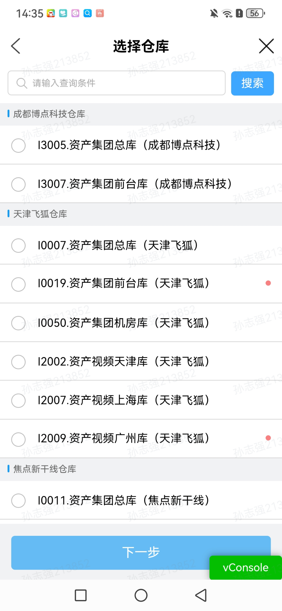
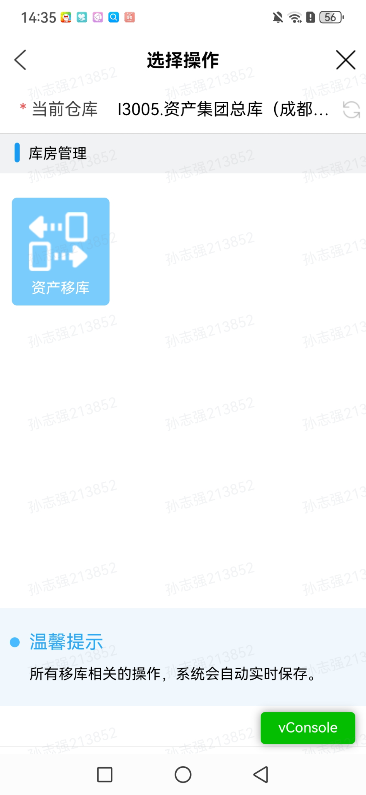
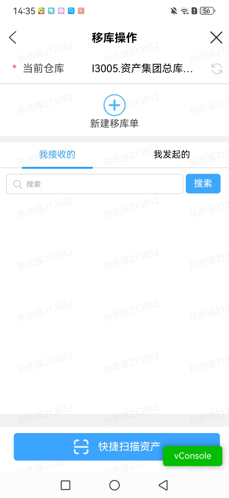
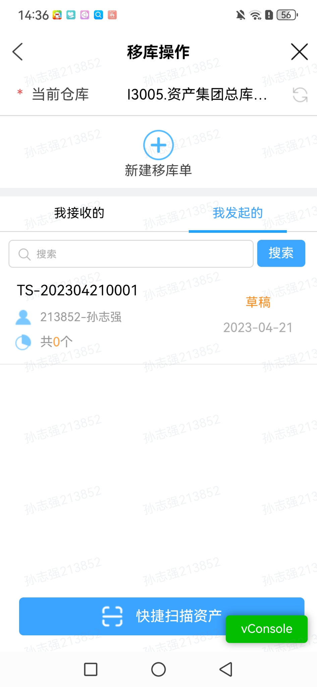
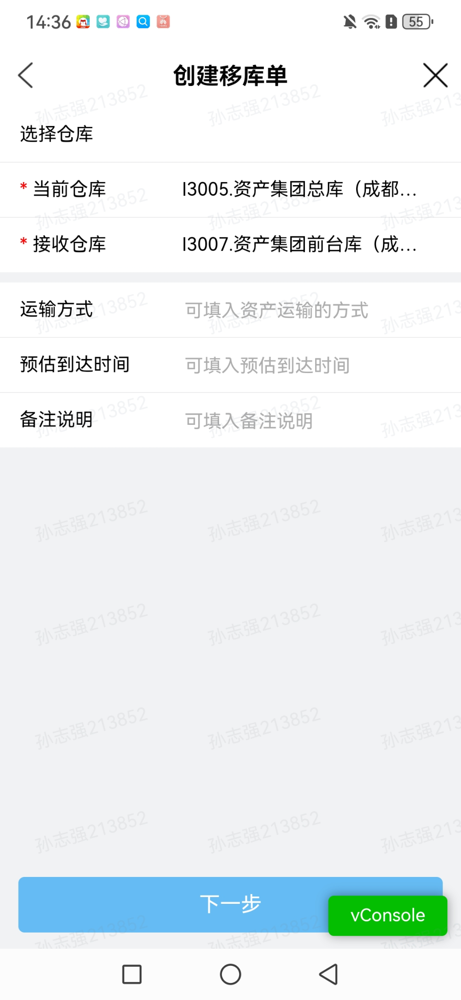
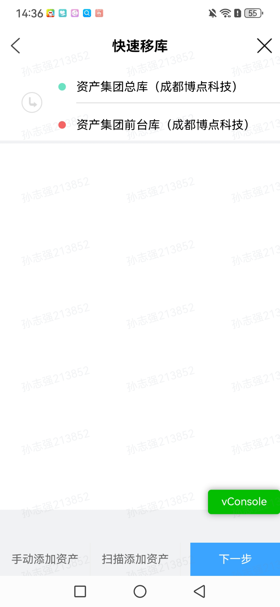
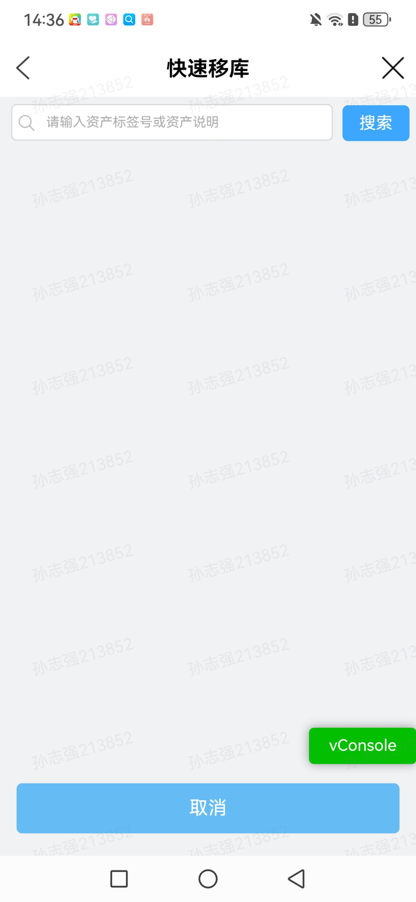
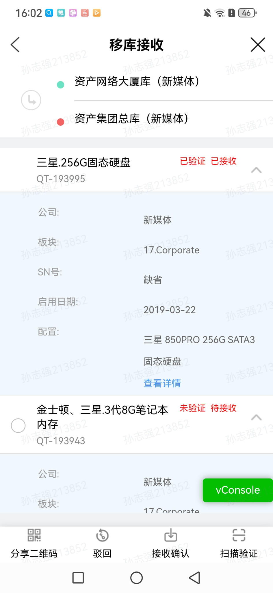
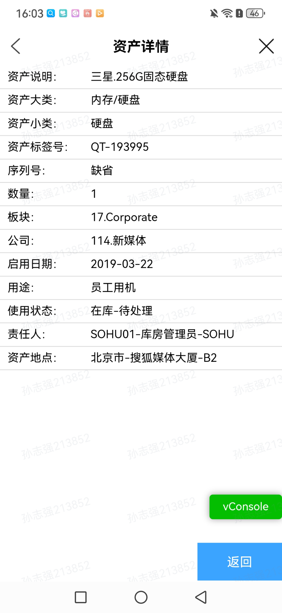

# 移库移动端原型

## 进入方式

- 本地启动后打开 `http://localhost:3000/inventory/move/mobile`。
- PC 移库列表右上角点击【移动端预览】。

## 原型范围

页面按《库存管理 - 移库 PRD》实现发起列表、接收列表、创建移库、物资添加、扫码验证、分批接收、驳回及快捷扫码。默认打开“我接收的”，待接收单排在前面；快捷扫描资产固定显示在“我接收的”页签底部。创建移库时可以打开手机摄像头扫描资产二维码，也可以手动选择物资；扫描弹层提供手电筒开关。接收详情按待接收、已完成、已驳回状态展示对应信息，移库明细可进入资产详情。草稿在添加首件物资后生成单号并实时保存在当前演示会话中；PC 专属的 Excel、打印和导出不出现在移动端。

仓库及物资基础信息来自项目现有仓库目录和移库物资池。原型用本地演示状态呈现流程，不连接后端或生产数据。移动端截图由用户提供，作为现状页面参考。

## 现状页面截图

| 页面 | 截图 |
|---|---|
| 选择仓库 |  |
| 选择操作 |  |
| 移库操作入口 |  |
| 我发起的 |  |
| 创建移库单 |  |
| 快捷移库入口 |  |
| 快捷移库查询 |  |
| 移库接收详情 |  |
| 资产详情 |  |
| 已完成或已驳回详情参考 |  |
